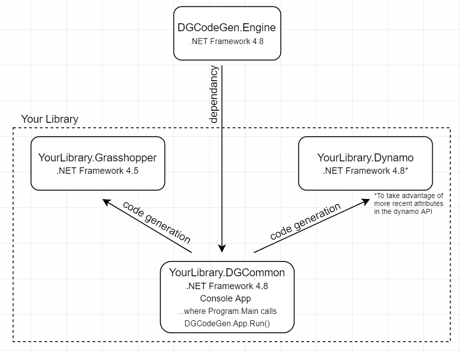

# DynamoGrasshopperCodeGen

# What is it?
A code generation toolset to port a set of functions to both [Dynamo](https://dynamobim.org/) and [Grasshopper](https://www.grasshopper3d.com/) as nodes. This is done by using code generation (Microsoft.CodeAnalysis) to generate C#.

The aim of this project is to simplify the process of writing plugins for grasshopper (dynamo support tbc). Traditionally, writing grasshopper nodes can involve writing a lot of boiler plate code to define/retrieve inputs and outputs etc... With DGCodeGen, nodes can be simply defined as static methods with attributes. For example, a grasshopper function can be defined as shown below:

        [GhFunc("CreateSomeData", "CSD", "TestLib", "SomeDataTests")]
        [DGDescription("Some description")]
        [DGOutput("SomeData", "SD", "Description")]
        public static SomeData CreateSomeData([DGInput("Integer", "I", "Desc")] int intValue)
        {
            var newSomeData = new SomeData(intValue);
            return newSomeData;
        }

Which can be used to automatically generate the required code shown below:

    public class CreateSomeData_Component : GH_Component
    {
        public CreateSomeData_Component(): base("CreateSomeData", "CSD", 
                                                "Some description", "TestLib", 
                                                "SomeDataTests")
        {
        }

        public override GH_Exposure Exposure => GH_Exposure.primary;
        protected override System.Drawing.Bitmap Icon => null;
        public override Guid ComponentGuid => new Guid("ad7c0bdf-32f9-4be3-80ae-1bc44a7d9641");
        protected override void RegisterInputParams(GH_Component.GH_InputParamManager pManager)
        {
            pManager.AddIntegerParameter("Integer", "I", "Description", GH_ParamAccess.item);
        }

        protected override void RegisterOutputParams(GH_Component.GH_OutputParamManager pManager)
        {
            pManager.AddParameter(new SomeData_Param(), "SomeData", "SD", "Description", GH_ParamAccess.item);
        }

        protected override void SolveInstance(IGH_DataAccess DA)
        {
            //Fetching node input: intValue.
            Int32 intValue = 0;
            if (!DA.GetData(0, ref intValue))
                return;

            //Function body
            var newSomeData = new SomeData(intValue);
            SomeData result = newSomeData;

            //Setting node output: result.
            SomeData_Goo result_gh = new SomeData_Goo(result);
            DA.SetData(0, result_gh);
        }
    }

Where node libraries need to pass around class objects, grasshopper requires that these be GhGoo and GhParameter classes. DGCodeGen can also automate the boiler plate code required to generate the Goo's and Paramters, by applying the [GhDataClass(xxx)] attribute to the POCO class, as shown below:

    [GhDataClass("SD", "TestLib", "SomeDataTests")]
    [DGDescription("Some data data data.")]
    public class SomeData
    {
        ...
    }

The eventual aim is to support Dynamo as well, which will allow the same definition of nodes to be ported to both Dynamo and Grasshopper in one go!

# How to use
1. Setup your solution as shown in the image below.
2. Define functions in static methods
3. Define dataclasses to be used in goo and params
4. Ensure YourLibrary.DGCommon is a console app, where Program.Main() calls DGCodeGen.Engine.App.Run(xxxx).
5. Run this console app and follow the instructions.
6. Manually add the newly generated c-sharp files to your project in visual studio (automatic process TBC)

# Defining functions
Generation instruction attributes, when added to methods, will tell DGCodeGen to generate a Dynamo/Grasshopper component for the specified method:
* `[GhFunc()]`  -> generates a grasshopper component only.  
* `[DyFunc()]`  -> generates a dynamo component only. (TBC)
* `[DGFunc()]`  -> generates components for BOTH dynamo and grasshopper.

Every component method must also be tagged with `[DGDescription()]`. In grasshopper, this will form the description when you hover over the component.

Node input parameters can be specified by adding input parameter in your method. Each input parameter must be tagged with a `[DGInput()]` attribute.

Node output parameters are specified in the method return value. For components with a return parameter, you must specify `[DGOutput()]`. Components with multiple return values can use a tuple return. Each tuple return value must have a corresponding `[DGOutput()]` attribute tagged onto the method.

# Defining dataclasses

POCO's can be tagged with the `[GhDataClass()]` attribute, causing Gh Goo's and Grasshopper Parameters to be automatically generated. When defining functions, you need only to refer to the POCO object. DGCodeGen will generate code to wrap/unwrap these for the inputs/outputs.

Every dataclass must also be tagged with `[DGDescription()]`.

# Input and output datatypes

* Types used within DGCommon are automatically converted to native types used in grasshopper. For example, the raw POCO dataclass class can be used in DGCommon. DGCodeGen will automatically write code to wrap a dataclass into a grasshopper Goo<dataclass>
* This applies to lists as well. For example, an input dataclass will be converted to a list of dataclass_goo's:  
  `List<Dataclass_Goo> dataclassList_gh = dataclassList.Select(obj => new DataClass_Goo(obj));` 
* Every type used as an input/output parameter must have an appropriate `TypeConversion` class. This tells DGCodeGen how this type can be added to a Grasshopper node. To add new types, it is necessary to inherit from `TypeConversion` or one of the child classes, and add that type to the `TypeDictionary`.
* More complex data structures such as nested lists, or grasshopper datatrees are not supported by this conversion.

# File management

* The generated .cs files need to be manually added to the project in visual studio
* The generated files will be located within a subfolder of each Dynamo/Grasshopper project called DGCodeGen.
* Files in .../DGCodeGen are overwritten on each run. To avoid overwriting edited files, move them out of this folder.
* Grasshopper component guids are automatically generated, and are saved in the method definition, under the `[GhGuid()]` attribute. This means that the .cs file defining each method may be overwritten during the running of this tool. Deleting this saved attribute will cause the tool to generate a new Guid.

# Todo

- [ ] Improve writing functions to Dynamo, which currently has very limited support. Basic features which are not currently supported include List types, Dataclasses etc...
- [ ] Error checking
- [ ] A standalone app/visual studio integration
- [ ] Selectively update functions/dataclasses. E.g. through marking with attributes.
- [ ] Allow users to add additional supported types in the from within the DGCommon library. E.g. by scanning for TypeConversions/TypeTemplates.